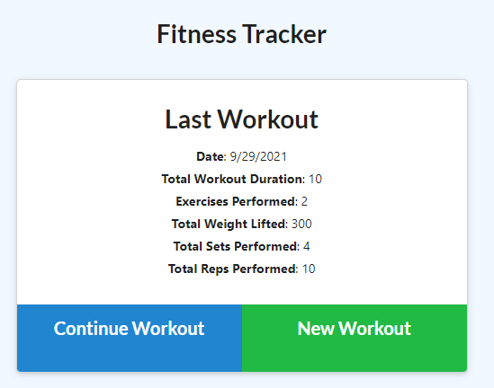
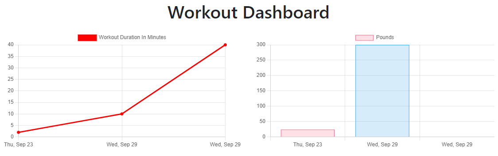

# Workout-Tracker

# Table of Contents
- [Username](#username)
- [Email](#emial)
- [Description](#description)
- [Dependencies](#dependencies)
- [Usage](#usage)
- [Licenses](#licenses)
- [Deployed](#deployed)

## GitHub Username
[Mike Sowers](https://github.com/msowers72)

## Email
<msowers72@yahoo.com>

## Description:
Today, the global gym industry has an estimated worth of over $96.7 billion dollars, 
and there are over 37,000 fitness applications, available in the Google Play store.
I've created a very simple and free fitness application that will allow users to track,
two different types of workouts. 

## Usage
The application will be used to generate a professional README for various projects

## Dependencies
* Express
* Mongoose
* Morgan
   

## Licenses 

<!--  -->
  
 ## Deployed
 
 
 https://young-retreat-50235.herokuapp.com/?id=614d1e2bf18c4e0016de5bcc

  
  